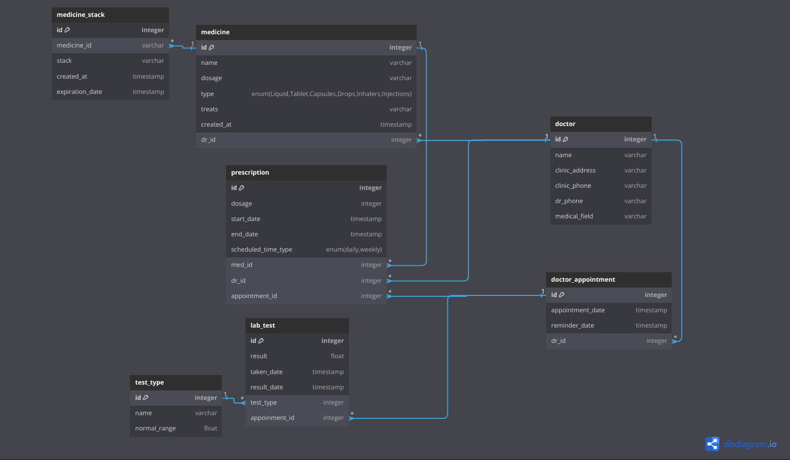

# Diabetes Database Service
Database service to the diabetes service
it contains of 2 databases setup

## MongoDB
This databse used to store all the meters and sensors reading, we chose mongodb since the readings are large number of data

## PostgreSQL
This database is used to keep track with all the medications, doctor appointments and lap tests.

<figure>
  
  <figcaption style="text-align: center;"> This is the ERD Diagram for the Database</figcaption>
</figure>